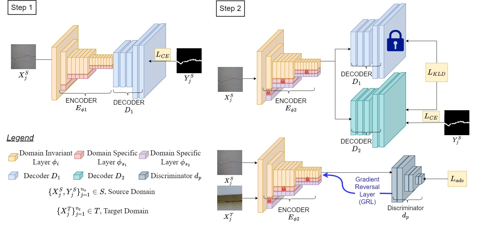
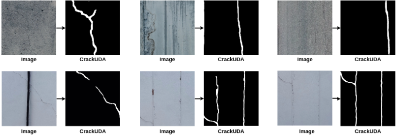

# CrackUDA: Incremental Unsupervised Domain Adaptation for Improved Crack Segmentation in Civil Structures.

[[Project Page]](https://crackuda.github.io/) [[Paper]](https://link.springer.com/chapter/10.1007/978-3-031-78113-1_6)

In Proceedings of the International Conference on Pattern Recognition (ICPR), 2024. 


<div align="center">
  
</div>

## Installation

```bash
conda create -n crackuda python=3.9
conda activate crackuda
conda install -c pytorch pytorch=1.10.1 torchvision=0.11.2 cudatoolkit=11.3.1
pip install matplotlib numpy==1.24 tensorboardX opencv-python pillow
```

## Datasets

- [CrackSeg9k](https://github.com/Dhananjay42/crackseg9k) Used as the source dataset for conducting the experiments reported in the paper.
- [BuildCrack](https://zenodo.org/records/14544429): Dataset introduced in this paper, used as target dataset along with sub-datasets of CrackSeg9k. 

The expected data sturcture for any dataset is as follows: 
```plaintext
   workspace/
   ├── source_dataset (CrackSeg9k) /
   |   ├──train 
   │        ├── images
   |            | image1.jpg
   |            | image2.jpg
   │        ├── labels
   |            | image1.png
   |            | image2.png
   |   ├──val 
   │        ├── images
   |            | image1.jpg
   |            | image2.jpg
   │        ├── labels
   |            | image1.png
   |            | image2.png
   ├── target_dataset (BuildCrack) /
   │   ├── images
   |        | image1.jpg
   |        | image2.jpg
   │   ├── labels
   |        | image1.png
   |        | image2.png
```

## Training 

Our approach operates in an incremental learning setting. In Step 1, we train for binary segmentaion on the CrackSeg9k dataset. You may chose to avoid sub-datasets of CrackSeg9k, and use it as a target dataset in Step 2 to perform Unsupervised Domain Adaptation. 

```bash
python train.py --save_dir <step1_save_path> --num_epochs 150 --source_dataset_path <source_dataset> --dataset_avoided <sub_dataset_name>
```

CrackSeg9k contains several subdatasets such as `Mason, Ceramic, CFD, etc.`. `--dataset_avoided` May or may not be set using the names of these sub-datasets. Use `'NA'` if no sub-dataset is to be avoided. 

For Step 2, we use the trained model from Step 1 to perform UDA using adversarial training through GRL. 

```bash
python train_step2.py --save_dir <step2_save_path> --num_epochs 20 --target_dataset_path <target_dataset> --source_dataset_path <source_dataset> --dataset_avoided <sub_dataset_name> --saved_model <step1_save_path>/best_model.pth
```

Ensure that `--dataset-avoided` is set with the same value for both steps. 
## Pretrained Models

Please find both Step 1 and Step 2 pretrained models [here](https://crackuda.github.io/).

## Inference

To evaluate the performance use the following commands: 
```bash
python eval_step1.py --weight <step1_save_path>/best_model.pth --source_dataset_path <source_dataset> --target_dataset_path <target_dataset> --dataset_avoided <sub_dataset_name>

python eval_step2.py --weight <step2_save_path>/best_model.pth --source_dataset_path <source_dataset> --target_dataset_path <target_dataset> --dataset_avoided <sub_dataset_name>
```
## Results

| DA Method         | Source (**CrackSeg9k**) | Target (**BuildCrack**) |
|--------------------|-------------------------|--------------------------|
| AdaptSegnet*      | 47.53                  | 48.47                   |
| MaxSquare         | 57.60                  | 50.50                   |
| ADVENT*           | 47.51                  | 48.47                   |
| IAST*             | 46.79                  | 46.78                   |
| DAFormer*         | 47.54                  | 48.47                   |
| DACS              | 58.46                  | 58.11                   |
| CBST*             | 47.53                  | 48.47                   |
| ProDA             | 50.32                  | 47.94                   |
| FADA              | 79.18                  | 60.73                   |
| **CrackUDA**      | **79.83**              | **63.43**               |

<div align="center">
  
</div>

## Citation
If you find the code and dataset useful, please cite this paper (and refer the dataset as BuildCrack):
```
@InProceedings{10.1007/978-3-031-78113-1_6,
author="Srivastava, Kushagra and Kancharla, Damodar Datta and Tahereen, Rizvi and Ramancharla, Pradeep Kumar
and Sarvadevabhatla, Ravi Kiran and Kandath, Harikumar",
title="CrackUDA: Incremental Unsupervised Domain Adaptation for Improved Crack Segmentation in Civil Structures",
booktitle="Pattern Recognition",
year="2025",
publisher="Springer Nature Switzerland",
address="Cham",
pages="74--89",
}
```

## Acknowledgements
The authors acknowledge the financial support provided by [IHuB-Data](https://ihub-data.iiit.ac.in/), IIIT Hyderabad to carry out this research work.

## References

We thank the following github repositories for the relevant open source code and models:

- [CrackSeg9k](https://github.com/Dhananjay42/crackseg9k)  
- [MDIL-SS](https://github.com/prachigarg23/MDIL-SS) 

